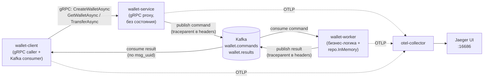

# Wallet Service — gRPC + Kafka + OpenTelemetry

Полностью асинхронный сервис кошельков. gRPC-фасад ничего не хранит и не
исполняет бизнес-логику — он только валидирует вход и публикует команду в
Kafka. Единственный исполнитель команд и владелец состояния — `wallet-worker`.
Клиент подписывается на топик результатов и сопоставляет ответ по
`msg_uuid`. Демонстрирует организацию OTel-трейсов, которые сквозным
образом проходят через gRPC → Kafka → gRPC-клиент.

## Структура

```
wallet-service/
├── cmd/
│   ├── server/main.go           # точка входа proxy: сигналы + serverapp.Run
│   └── worker/main.go           # точка входа worker: сигналы + workerapp.Run
├── client/main.go               # тестовый клиент: publish + ждёт результат из Kafka
├── internal/
│   ├── serverapp/                # сборка зависимостей proxy (gRPC + Kafka producer)
│   ├── workerapp/                 # сборка зависимостей worker (Kafka consumer + бизнес-логика)
│   ├── handler/grpc.go          # тонкий gRPC handler: валидация + publish
│   ├── async/
│   │   ├── broker.go            # транспортный контракт Broker
│   │   ├── kafka_broker.go      # реализация поверх Kafka (sarama)
│   │   ├── inmemory_broker.go   # реализация для unit-тестов
│   │   └── service.go           # продьюсер команд + обработчик команд (worker)
│   ├── wallet/
│   │   ├── service.go           # бизнес-логика + ручные спаны (только внутри worker)
│   │   └── service_test.go
│   ├── repo/
│   │   └── memory.go            # репо с дочерними спанами (единственный экземпляр — в worker)
│   └── telemetry/
│       └── provider.go          # InitTracer — один раз в serverapp/workerapp/client
├── proto/
│   ├── wallet.proto              # публичный gRPC API — только *Async методы
│   └── messages.proto            # WalletCommand / WalletResult — сообщения в Kafka
├── collector/config.yaml         # OTel Collector
├── docker-compose.yml
├── Makefile
└── README.md
```

## Архитектура



gRPC-вызов у клиента возвращает только `accepted` — сам результат
(`CreateWalletResult` / `GetWalletResult` / `TransferResult` / `WalletResultError`)
приходит отдельным сообщением в `wallet.results`, которое клиент читает через
собственную (уникальную на каждый запуск) consumer group.

## Запуск

```bash
# Зависимости
make tidy

# Перегенерировать protobuf после правки .proto
make proto-gen

# Unit тесты (без Docker, без сети)
make test

# С подробным выводом / покрытием / race detector
make test-verbose
make test-cover
make test-race

# Поднять весь стек (Kafka, ZooKeeper, otel-collector, Jaeger, все три Go-сервиса)
make build
make up

# Jaeger UI
open http://localhost:16686
```

## Демо-сценарий (wallet-client)

`client/main.go` — не библиотека, а исполняемый прогон, при каждом запуске
делает 5 async-вызовов подряд:

1. `CreateWalletAsync` — alice, `initial_balance=500`
2. `CreateWalletAsync` — bob, `initial_balance=0`
3. `GetWalletAsync` × 2 — баланс обоих кошельков до перевода
4. `TransferAsync` — 150 alice → bob
5. `GetWalletAsync` × 2 — баланс обоих кошельков после перевода

Каждый вызов — отдельный `msg_uuid` (== `trace_id`, см. ниже) и отдельный
трейс в Jaeger.

## Трейс в Jaeger

Один вызов `CreateWalletAsync` создаёт такое дерево спанов:

```
client.create_wallet                        (wallet-client, ручной, открыт до ответа)
  └── wallet.WalletService/CreateWalletAsync (wallet-client, otelgrpc auto)
        └── wallet.WalletService/CreateWalletAsync (wallet-service, otelgrpc auto)
              ├── proxy.validate                    (wallet-service, ручной)
              └── wallet-service.publish-command     (wallet-service, ручной)
                    └── wallet-worker.process-command (wallet-worker, ручной)
                          ├── wallet.CreateWallet         (wallet-worker, ручной)
                          │     └── repo.Create             (wallet-worker, ручной)
                          └── wallet-worker.publish-result  (wallet-worker, ручной)
                                └── wallet-client.consume-result (wallet-client, ручной)
```

Спан `client.create_wallet` закрывается только когда клиент получает
соответствующее сообщение из `wallet.results` — так один trace покрывает
весь асинхронный путь end-to-end, а не только синхронный `accepted` от gRPC.

## Ключевые решения

- **Только асинхронный путь** — синхронных RPC (`CreateWallet`, `Transfer`, `GetWallet`
  без suffix `Async`) нет вообще; `wallet-service` не хранит состояние и не
  исполняет бизнес-логику.
- **Единственный владелец состояния** — `wallet-worker`: единственный
  консьюмер `wallet.commands` и единственный экземпляр `repo.InMemory`.
- **`main` — только точка входа** — вся сборка зависимостей (`InitTracer`,
  broker, gRPC server / Kafka consumer) вынесена в `internal/serverapp` и
  `internal/workerapp`; `cmd/*/main.go` лишь настраивают отмену по сигналу и
  вызывают `Run(ctx)`.
- **Trace-контекст через заголовки Kafka** — `traceparent` кладётся в
  заголовки сообщения (`InjectTraceHeaders`/`ExtractTraceContext`), не в тело
  — так спан в worker'е становится child-спаном от `publish-command`, а не
  новым root-трейсом.
- **`trace_id = msg_uuid`** — клиент сидирует корневой спан кастомным
  `sdktrace.IDGenerator` (`internal/telemetry/idgen.go`) тем же UUID, что уже
  используется как `msg_uuid` для сопоставления команды и результата. Трейс в
  Jaeger открывается напрямую по `GET /api/traces/<uuid без дефисов>`, без
  поиска по тегу.
- **Баланс/сумма — `uint64`** — деньги представлены в целых единицах валюты
  и на wire (proto), и в бизнес-логике; отрицательные значения невозможны на
  уровне типов, а не только валидацией в рантайме.
- **`otel.Tracer()` в конструкторе** — не в каждом методе.
- **`ctx` везде** — любая IO функция принимает context первым аргументом.
- **`defer span.End()`** — всегда сразу после `Start`.
- **`span.RecordError(err)`** — вместо просто `log.Printf`.
- **Unit тесты без OTel** — `otel.Tracer()` возвращает no-op, если провайдер
  не инициализирован; для async-путей тесты гоняют `InMemoryBroker` вместо
  Kafka.
